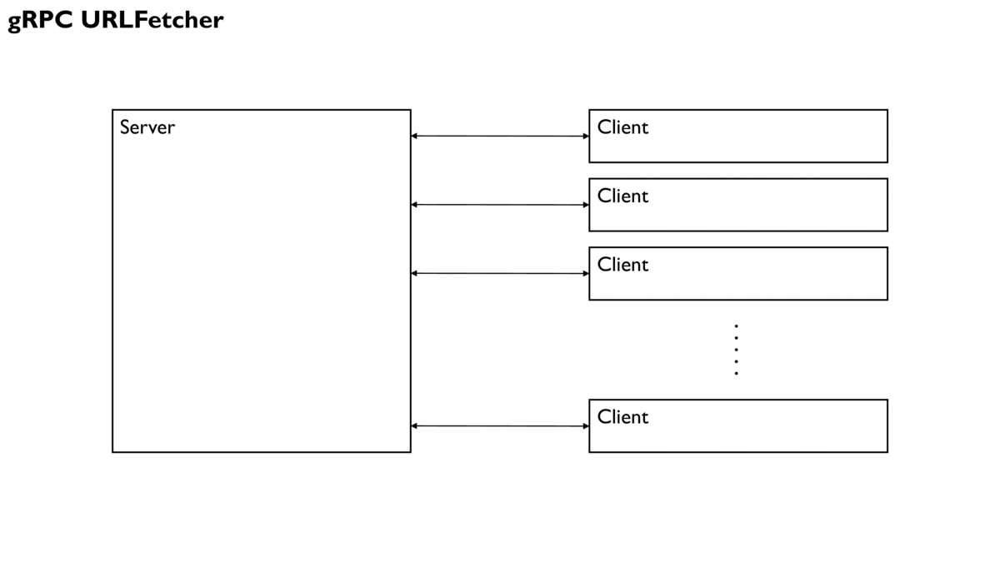

# grpc-url-fetcher

gRPC and cURL powered URL fetching service with internal thread pool to hide HTTP latency.
URL fetching is used only to simulate generic, long running, high-latency tasks performed in the backend.



## C++ API

Start a server:
```c++
#include <string>
#include "URLFetcherServer.hpp"

using urlfetcher::server::run_forever;

int main(int argc, char** argv) {
    std::string grpc_address{"localhost:8000"};
    int thread_pool_size{8};
    run_forever(grpc_address, thread_pool_size);
    return 0;
}
```

Request some URLs and get responses over a bidirectional gRPC stream:
```c++
#include <iostream>
#include <string>
#include <vector>
#include "URLFetcherClient.hpp"

using urlfetcher::Response;
using urlfetcher::client::uint64;
using urlfetcher::client::URLFetcherClient;

int main(int argc, char** argv) {
    std::string grpc_address{"localhost:8000"};
    std::vector<std::string> urls = {
        "https://matiaslindgren.github.io/",
        "https://httpstat.us/200",
        "https://httpstat.us/308",
        "https://httpstat.us/404",
        "https://yle.fi",
    };
    URLFetcherClient fetcher{grpc_address};
    // Request a fetch of URLs, this call resolves immediately, returning a list of keys
    std::vector<uint64> keys = fetcher.request_fetches(urls);
    std::cout << "Pending fetch UUIDs returned by the server:\n";
    std::copy(keys.begin(), keys.end(), std::ostream_iterator<uint64>(std::cout, " "));
    std::cout << "\n";
    // The server passes all URLs to its thread pool, which starts to fetch them with cURL
    // We can ask for the resolved requests by passing the UUIDs returned by the server
    std::vector<Response> responses = fetcher.resolve_fetches(keys);
    std::cout << "Resolved URL requests returned by the server:\n";
    for (int i = 0; i < urls.size(); ++i) {
        std::cout
            << urls[i]
            << ", header size " << responses[i].header().size()
            << ", body size " << responses[i].body().size()
            << ", error code " << responses[i].curl_error()
            << "\n";
    }
    return 0;
}
```

Send a SIGTERM or SIGINT to the server to shut it down.


## Building and testing with Docker

Five Dockerfiles have been included for building the project and the test runners.
Build them by running:
```
sh docker/build-all-images.sh
```
Run `docker images` and check that you have at least these three images:
```
REPOSITORY          TAG                 IMAGE ID            CREATED             SIZE
test-runner         v1                  56fd9d9a9dad        9 seconds ago       156MB
http-echo-server    v1                  4d3c73c1985f        3 minutes ago       133MB
urlfetcher          v1                  212403e61f56        3 minutes ago       156MB
```
To run the tests, you need to first start a Flask HTTP echo server that simply returns the URL route key for every HTTP GET request.
```
sh docker/run-echo-server.sh
```
In a second terminal, run all tests:
```
sh docker/run-tests.sh
```
The gRPC URL fetcher will request a lot of URLs from the localhost Flask server.
It will also request a few external URLs (see `external_urls` in `tests/main.cpp`).

The amount of tests have been reduced in the executable Docker image `test-runner` because sometimes the tests fail as the little Flask server cannot keep up with thousands of concurrent requests.

**NOTE** There are some hard-coded Docker network IPs in the Dockerfiles that you might need to fix to ensure the containers can discuss with each other if Docker happens to use different IPs in the `bridge` network.

### C++ API example

Two additional Dockerfiles have been included for running the executables created from `src/URLFetcherServer.cpp` and `src/URLFetcherClient.cpp`.
Running `docker/build-all-images.sh` should have also created these two images:
```
REPOSITORY          TAG                 IMAGE ID            CREATED             SIZE
urlfetcher-server   v1                  453ac0d53898        3 minutes ago       156MB
urlfetcher-client   v1                  4de14004f5c9        3 minutes ago       156MB
```
These correspond to the simple readme examples shown above, to which command line argument parsing has been added with `cxxopts`.

To run these as Docker containers, start the server:
```
docker run --name=urlfetcher-server --network=bridge --rm urlfetcher-server:v1
```
In another terminal, start the client to request 5 external URLs:
```
docker run --name=urlfetcher-client --network=bridge --rm urlfetcher-client:v1
```
